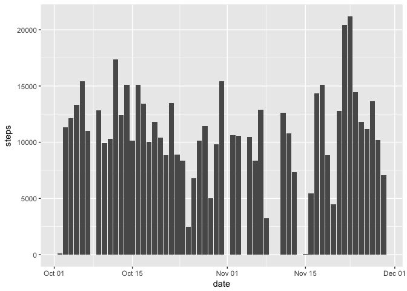
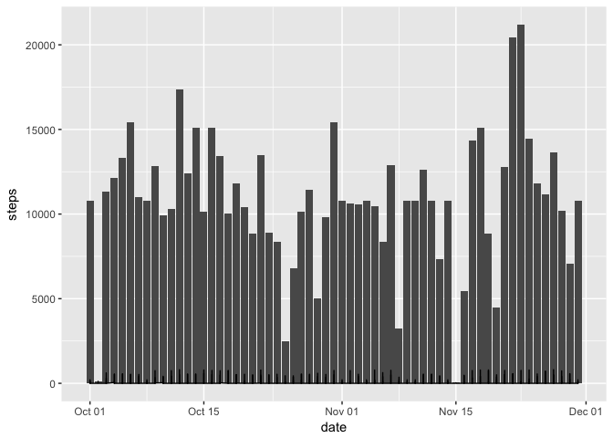
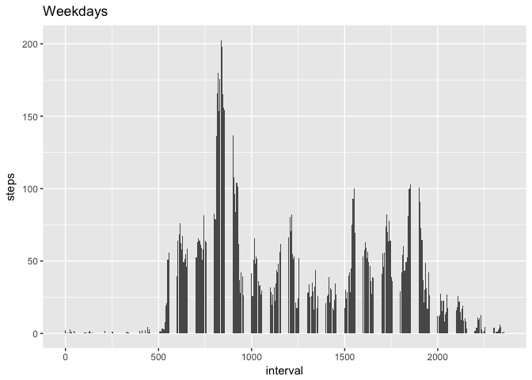
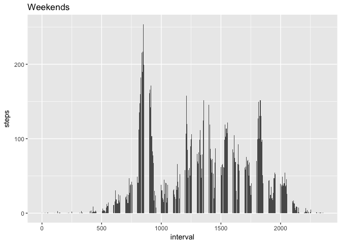

# Reproducible Research: Peer Assessment 1


## Loading and preprocessing the data

```r
download.file("https://d396qusza40orc.cloudfront.net/repdata%2Fdata%2Factivity.zip", destfile = "./r/activity.zip",method = "curl")
unzip("./r/activity/activity.zip", exdir = "./r/activity/")
amdata<- read.csv("./r/activity/activity.csv", stringsAsFactors = FALSE)
amdata$date<- as.Date(amdata$date,"%Y-%m-%d")
```


## What is mean total number of steps taken per day?
Histogram of the total number of steps taken each day

```r
library(ggplot2)
ggplot(data = amdata,
  aes(date, steps)) +
  stat_summary(fun.y = sum,
    geom = "bar") 
```

<!-- -->

Calculate and report the mean and median total number of steps taken per day

```r
q3sum <- aggregate(steps ~ date, amdata, sum)
q3mean <- aggregate(steps ~ date, amdata, mean)
q3median <- aggregate(steps ~ date, amdata, median, na.rm=TRUE)
q3data <- merge(q3sum, q3mean, by = "date")
q3data <- merge(q3data, q3median, by = "date")
q3data <- setNames(q3data, c("Date", "Total steps", "Mean", "Median"))
q3data
```

```
##          Date Total steps       Mean Median
## 1  2012-10-02         126  0.4375000      0
## 2  2012-10-03       11352 39.4166667      0
## 3  2012-10-04       12116 42.0694444      0
## 4  2012-10-05       13294 46.1597222      0
## 5  2012-10-06       15420 53.5416667      0
## 6  2012-10-07       11015 38.2465278      0
## 7  2012-10-09       12811 44.4826389      0
## 8  2012-10-10        9900 34.3750000      0
## 9  2012-10-11       10304 35.7777778      0
## 10 2012-10-12       17382 60.3541667      0
## 11 2012-10-13       12426 43.1458333      0
## 12 2012-10-14       15098 52.4236111      0
## 13 2012-10-15       10139 35.2048611      0
## 14 2012-10-16       15084 52.3750000      0
## 15 2012-10-17       13452 46.7083333      0
## 16 2012-10-18       10056 34.9166667      0
## 17 2012-10-19       11829 41.0729167      0
## 18 2012-10-20       10395 36.0937500      0
## 19 2012-10-21        8821 30.6284722      0
## 20 2012-10-22       13460 46.7361111      0
## 21 2012-10-23        8918 30.9652778      0
## 22 2012-10-24        8355 29.0104167      0
## 23 2012-10-25        2492  8.6527778      0
## 24 2012-10-26        6778 23.5347222      0
## 25 2012-10-27       10119 35.1354167      0
## 26 2012-10-28       11458 39.7847222      0
## 27 2012-10-29        5018 17.4236111      0
## 28 2012-10-30        9819 34.0937500      0
## 29 2012-10-31       15414 53.5208333      0
## 30 2012-11-02       10600 36.8055556      0
## 31 2012-11-03       10571 36.7048611      0
## 32 2012-11-05       10439 36.2465278      0
## 33 2012-11-06        8334 28.9375000      0
## 34 2012-11-07       12883 44.7326389      0
## 35 2012-11-08        3219 11.1770833      0
## 36 2012-11-11       12608 43.7777778      0
## 37 2012-11-12       10765 37.3784722      0
## 38 2012-11-13        7336 25.4722222      0
## 39 2012-11-15          41  0.1423611      0
## 40 2012-11-16        5441 18.8923611      0
## 41 2012-11-17       14339 49.7881944      0
## 42 2012-11-18       15110 52.4652778      0
## 43 2012-11-19        8841 30.6979167      0
## 44 2012-11-20        4472 15.5277778      0
## 45 2012-11-21       12787 44.3993056      0
## 46 2012-11-22       20427 70.9270833      0
## 47 2012-11-23       21194 73.5902778      0
## 48 2012-11-24       14478 50.2708333      0
## 49 2012-11-25       11834 41.0902778      0
## 50 2012-11-26       11162 38.7569444      0
## 51 2012-11-27       13646 47.3819444      0
## 52 2012-11-28       10183 35.3576389      0
## 53 2012-11-29        7047 24.4687500      0
```

## What is the average daily activity pattern?
Make a time series plot (i.e. type = "l") of the 5-minute interval (x-axis) and the average number of steps taken, averaged across all days (y-axis). Time format for interval is not changed: 0 => 00:00, 500 => 05:00, 1500 => 15:00

```r
cleandata <- amdata[!is.na(amdata$steps),] ## exclude NA values
q4data <- aggregate(steps~interval, data=cleandata, FUN=mean) 
library(ggplot2)
qplot(x=interval, y=steps, data = q4data, geom="line")
```

<!-- -->

Which 5-minute interval, on average across all the days in the dataset, contains the maximum number of steps?

```r
q4data[max(q4data$steps),]
```

```
##     interval    steps
## 206     1705 56.30189
```

## Imputing missing values
Calculate and report the total number of missing values in the dataset (i.e. the total number of rows with NAs)

```r
sum(is.na(amdata$steps))
```

```
## [1] 2304
```
Strategy for filling in all of the missing values in the dataset: average for each 5-minute interval across all days. Create a new dataset that is equal to the original dataset but with the missing data filled in.

```r
q6data <- amdata
for(i in which(is.na(q6data[, "steps"]))) {
  q6data$steps[i] <- q4data[q6data$interval[i]==q4data$interval,"steps"]
}
```
Make a histogram of the total number of steps taken each day and Calculate and report the mean and median total number of steps taken per day. 

```r
library(ggplot2)
ggplot(data = q6data,
  aes(date, steps)) +
  stat_summary(fun.y = sum, # adds up all observations for the date
    geom = "bar") +
  geom_line()
```

<!-- -->

```r
q7sum <- aggregate(steps ~ date, q6data, sum)
q7mean <- aggregate(steps ~ date, q6data, mean)
q7median <- aggregate(steps ~ date, q6data, median)
q7data <- merge(q7sum, q7mean, by = "date")
q7data <- merge(q7data, q7median, by = "date")
q7data <- setNames(q7data, c("Date", "Total steps", "Mean", "Median"))
q7data
```

```
##          Date Total steps       Mean   Median
## 1  2012-10-01    10766.19 37.3825996 34.11321
## 2  2012-10-02      126.00  0.4375000  0.00000
## 3  2012-10-03    11352.00 39.4166667  0.00000
## 4  2012-10-04    12116.00 42.0694444  0.00000
## 5  2012-10-05    13294.00 46.1597222  0.00000
## 6  2012-10-06    15420.00 53.5416667  0.00000
## 7  2012-10-07    11015.00 38.2465278  0.00000
## 8  2012-10-08    10766.19 37.3825996 34.11321
## 9  2012-10-09    12811.00 44.4826389  0.00000
## 10 2012-10-10     9900.00 34.3750000  0.00000
## 11 2012-10-11    10304.00 35.7777778  0.00000
## 12 2012-10-12    17382.00 60.3541667  0.00000
## 13 2012-10-13    12426.00 43.1458333  0.00000
## 14 2012-10-14    15098.00 52.4236111  0.00000
## 15 2012-10-15    10139.00 35.2048611  0.00000
## 16 2012-10-16    15084.00 52.3750000  0.00000
## 17 2012-10-17    13452.00 46.7083333  0.00000
## 18 2012-10-18    10056.00 34.9166667  0.00000
## 19 2012-10-19    11829.00 41.0729167  0.00000
## 20 2012-10-20    10395.00 36.0937500  0.00000
## 21 2012-10-21     8821.00 30.6284722  0.00000
## 22 2012-10-22    13460.00 46.7361111  0.00000
## 23 2012-10-23     8918.00 30.9652778  0.00000
## 24 2012-10-24     8355.00 29.0104167  0.00000
## 25 2012-10-25     2492.00  8.6527778  0.00000
## 26 2012-10-26     6778.00 23.5347222  0.00000
## 27 2012-10-27    10119.00 35.1354167  0.00000
## 28 2012-10-28    11458.00 39.7847222  0.00000
## 29 2012-10-29     5018.00 17.4236111  0.00000
## 30 2012-10-30     9819.00 34.0937500  0.00000
## 31 2012-10-31    15414.00 53.5208333  0.00000
## 32 2012-11-01    10766.19 37.3825996 34.11321
## 33 2012-11-02    10600.00 36.8055556  0.00000
## 34 2012-11-03    10571.00 36.7048611  0.00000
## 35 2012-11-04    10766.19 37.3825996 34.11321
## 36 2012-11-05    10439.00 36.2465278  0.00000
## 37 2012-11-06     8334.00 28.9375000  0.00000
## 38 2012-11-07    12883.00 44.7326389  0.00000
## 39 2012-11-08     3219.00 11.1770833  0.00000
## 40 2012-11-09    10766.19 37.3825996 34.11321
## 41 2012-11-10    10766.19 37.3825996 34.11321
## 42 2012-11-11    12608.00 43.7777778  0.00000
## 43 2012-11-12    10765.00 37.3784722  0.00000
## 44 2012-11-13     7336.00 25.4722222  0.00000
## 45 2012-11-14    10766.19 37.3825996 34.11321
## 46 2012-11-15       41.00  0.1423611  0.00000
## 47 2012-11-16     5441.00 18.8923611  0.00000
## 48 2012-11-17    14339.00 49.7881944  0.00000
## 49 2012-11-18    15110.00 52.4652778  0.00000
## 50 2012-11-19     8841.00 30.6979167  0.00000
## 51 2012-11-20     4472.00 15.5277778  0.00000
## 52 2012-11-21    12787.00 44.3993056  0.00000
## 53 2012-11-22    20427.00 70.9270833  0.00000
## 54 2012-11-23    21194.00 73.5902778  0.00000
## 55 2012-11-24    14478.00 50.2708333  0.00000
## 56 2012-11-25    11834.00 41.0902778  0.00000
## 57 2012-11-26    11162.00 38.7569444  0.00000
## 58 2012-11-27    13646.00 47.3819444  0.00000
## 59 2012-11-28    10183.00 35.3576389  0.00000
## 60 2012-11-29     7047.00 24.4687500  0.00000
## 61 2012-11-30    10766.19 37.3825996 34.11321
```

## Are there differences in activity patterns between weekdays and weekends?
Create a new factor variable in the dataset with two levels -- "weekday" and "weekend" indicating whether a given date is a weekday or weekend day.

```r
q8data<- q6data
library(lubridate)
```

```
## 
## Attaching package: 'lubridate'
```

```
## The following object is masked from 'package:base':
## 
##     date
```

```r
q8data$date<- as.POSIXct(q6data$date, format="%Y-%m-%d")
q8weekends<- q8data[wday(q8data$date) %in% 6:7,]
q8weekdays<- q8data[wday(q8data$date) %in% 1:5,]
```
Make a panel plot containing a time series plot (i.e. type = "l") of the 5-minute interval (x-axis) and the average number of steps taken, averaged across all weekday days or weekend days (y-axis). 

```r
library(ggplot2)
ggplot(data = q8weekdays,
  aes(interval, steps)) +
  stat_summary(fun.y = mean, 
  geom = "bar")+
  ggtitle("Weekdays")
```

<!-- -->

```r
library(ggplot2)
ggplot(data = q8weekends,
  aes(interval, steps)) +
  stat_summary(fun.y = mean, 
    geom = "bar")+
  ggtitle("Weekends") 
```

<!-- -->
